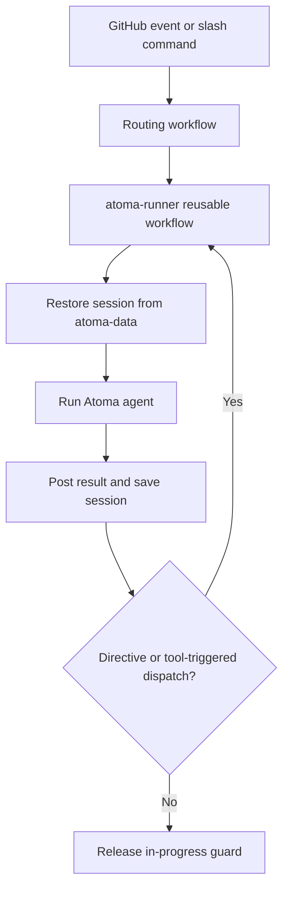

# Atoma Autonomous Delivery

Atoma Autonomous Delivery is a copyable GitHub Actions delivery system powered by Atoma, not Atoma core itself.

## What you get

After adoption, opening or updating an issue/PR can trigger an agent run that:

- restores per-agent session context
- runs Atoma with your configured agent/tools/skills
- comments results back on the issue/PR
- dispatches the next agent when a handoff directive is present

## Shortest adoption path

The deliverable ships as a release asset. Extract it at your repository root — the
archive holds `.github/`, so the files land where they belong:

```bash
cd /path/to/your-repo
curl -fsSL -o atoma-delivery.zip \
  https://github.com/yuma-seno/atomaton/releases/latest/download/atoma-delivery.zip
unzip -o atoma-delivery.zip
rm atoma-delivery.zip
```

Then commit in your target repository.

`latest` is the convenient path. Pin a version instead when you want to know what
you adopted and diff it later — see
[Upgrading an adopted repository](docs/customization.md#upgrading-an-adopted-repository):

```bash
gh release download v0.1.1 -R yuma-seno/atomaton -p atoma-delivery.zip
```

## Preflight checklist

Required before first run:

- GitHub Actions enabled in the target repository.
- In the target repository, open **Settings > Actions > General > Workflow permissions** and enable **Allow GitHub Actions to create and approve pull requests**. Without this repository-level permission, the engineer agent cannot create pull requests.
- Repository secret **`OPENROUTER_API_KEY`**. This is the one the shipped
  configuration needs: all three agent definitions read
  `provider: openrouter-responses`.

  One provider, one credential, and **no fallback** — a key under a different name
  does not stand in for this one, and two keys present is an error naming both
  rather than a precedence that picks for you. To run somewhere else, change
  `provider` in the agent definitions and add that provider's own secret; the eight
  values and the credential each reads are in
  [Choose which API an agent's provider speaks](docs/customization.md#choose-which-api-an-agents-provider-speaks).
- If a branch ruleset requires a status check, the workflow that produces it must
  be startable with `workflow_dispatch`. Agents run it themselves; a workflow they
  cannot start leaves the check unfilled and the pull request unmergeable
  forever. See
  [Requiring a check that agents can satisfy](docs/customization.md#requiring-a-check-that-agents-can-satisfy).
- An agent will not merge a pull request that changes how agents run — workflows,
  agent definitions, and similar. It reviews and reports; the merge is yours. See
  [Changes an agent may not merge](docs/customization.md#changes-an-agent-may-not-merge).
- Nothing to do for labels. `atoma/in-progress`, `atoma/sub-issue` and
  `atoma/launched` are created on first use. Rename them in `config.json` if your
  taxonomy differs.
- Nothing to do about `.gitignore`. A run keeps its own files — the session, the
  logs, the fetched events — outside the work tree, so `git add -A` never sees
  them. Earlier versions wrote them to the repository root and asked you for five
  `.gitignore` lines; if you have them, they are harmless and can go.

- Optional repository variables, both for reaching a provider somewhere other than
  its default host:
  - `ATOMA_PROVIDER` — overrides the `provider` in an agent definition. One of the
    eight values in the table linked above, not two.
  - `OPENAI_BASE_URL` — OpenAI's endpoint only. Each provider has its own
    (`OPENROUTER_BASE_URL`, `ANTHROPIC_BASE_URL`, and so on), for the same reason
    each has its own credential.

Workflow permissions are already declared in the generated workflows (`actions`, `issues`, `pull-requests`, `contents` set to write where needed), but they do not override the repository-level setting above.

## First issue and success criteria

Create an issue whose first non-blank line is a slash command, for example:

```text
/orchestrator

Build a plan to split this task into sub-issues.
```

Observable success criteria:

- `Atoma Entry` routes to `atoma-runner`.
- The issue gets the `atoma/in-progress` label while running.
- The agent posts a result comment or performs a visible handoff/tool action.

## Lifecycle



## Choose your path

- Customization contract and recipes: [docs/customization.md](docs/customization.md)
- Runtime operations and troubleshooting: [docs/operations.md](docs/operations.md)
- Contributing to this template repository: [CONTRIBUTING.md](CONTRIBUTING.md)
- Atoma core CLI/runtime docs: https://github.com/yuma-seno/atoma

## Limits, security, and cost notes

- What bounds a run: the 60-minute job timeout, minus five minutes for saving the
  session and posting the result. The runner hands the agent whatever is left of
  that when it starts, so a run that reaches it stops itself and stays resumable.
  There is no ceiling on turns; a new run gets a fresh budget.
- How a person intervenes: `/stop` on the issue stops the run at its next turn with
  its session saved, and `/resume` continues it. See
  [docs/operations.md](docs/operations.md).
- What bounds a chain of runs: validation hands a pull request back to the engineer
  at most three times. **There is currently no working cap on agent-to-agent
  handoffs** — one is written but cannot fire, and there is no token or cost
  ceiling at all. See
  [#456](https://github.com/yuma-seno/atomaton/issues/456); this
  line claimed a cap of five until that was measured.
- Session serialization per issue/PR is guarded by the `atoma/in-progress` label and workflow concurrency group.
- Every tool server runs as one dedicated OS user with no sudo, so no tool sees a different filesystem or `$HOME` than another. The provider API key is never in a tool server; the servers shipped here protect their own credentials; `GH_TOKEN` and any credential you route to a THIRD-PARTY server are readable by the shell tool. That is a deliberate trade -- see [What a tool can and cannot be protected from](docs/customization.md#what-a-tool-can-and-cannot-be-protected-from).
- The shell guard is not a security control. It routes the agent to the MCP tool that does the job properly (`gh` to the GitHub tools, `curl` to `web__fetch`, raw `git` mutations to `github__*`); it is a text match over a command line and does not resist being worked around. What carries that weight is per-tool credential confinement -- a server reaches only the secrets its `tools.yaml` entry declares -- and the governed-paths merge gate.
- Some workflows use `pull_request_target`, which runs with base-repository privileges. Review your repository policy for third-party PRs.
- An agent only starts when a repository member triggered it. Outside contributors can open issues, comment and raise pull requests freely; none of it dispatches an agent, so no untrusted instruction reaches one and no model budget is spent. Every routing workflow fires on a human action, and agents reach the runner through `workflow_dispatch` instead, so this covers the whole untrusted surface.
