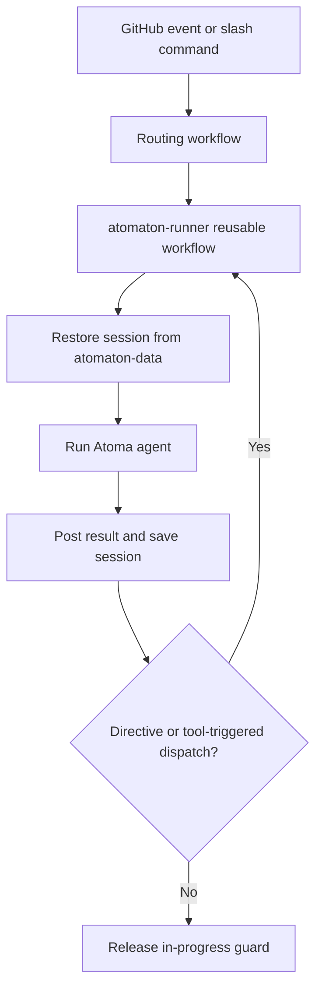

# Operations

This page is for somebody who already has Atomaton running: how the machinery behaves,
and how to work out why it just did that.

## How work starts

**Somebody asks.** That is the whole rule, and it is the only one.

| who asks | how |
| --- | --- |
| a person | comment `/engineer` (or any agent name) on an issue or pull request |
| an agent | names the next agent as its handoff, or `reviewer=` when it opens a pull request |

Nothing starts from a GitHub event on its own. Opening a pull request starts nobody;
pushing to one starts nobody; leaving a review starts nobody.

**This changed.** There was once an `auto_triggers` setting, with four entries that
started a reviewer on `pull_request.opened`, `synchronize` and `ready_for_review`,
and an engineer on a `changes_requested` review. Two rules to learn instead of one
— and the event-driven half was invisible in a way that mattered: GitHub raises no
workflow event for anything its own token did, so those triggers fired only for a
**person's** pull request. An agent's went through a different path entirely. One
behaviour, two mechanisms, each looking like the whole.

Removing them also closed a hole. `synchronize → reviewer` and
`changes_requested → engineer` could pass a pull request back and forth without
limit, because [the handoff limit](#what-bounds-a-chain-of-runs) only counts the
path where an agent asks. Now every path is that path.

### GitHub raises no event for its own token

Stated once here, because it explains more of this page than any other single fact:
**GitHub starts no workflow run for events `GITHUB_TOKEN` triggers.** An agent's
issues, comments, pull requests and merges are all made with that token, so nothing
an agent does raises an event, and everything downstream of an agent's action is
dispatched explicitly instead.

- `create_pr` dispatches `atomaton-validate-pr.yml`. It cannot listen for the pull
  request it just opened.
- A merge is followed by an explicit dispatch of CI and deployment. Nothing
  downstream of it fires by itself, so a deployment chained off CI or off a push to
  the base branch would otherwise silently never run.
- A workflow that creates an issue — a weekly schedule, say — has to dispatch
  `atomaton-runner.yml` itself, in a last step that is not optional.

`atomaton-pr-merged.yml` is the one path that listens rather than being dispatched: it
uses `pull_request_target`, so a merge is detected whoever or whatever performed it.

### When nobody is named to look at it

Asking explicitly means it can be forgotten. An agent that opens a pull request with
no `reviewer` and mentions nobody leaves work that nothing is scheduled to look at —
CI runs, the check goes green, and it waits.

So the machinery checks and says so, on the pull request:

> This pull request was opened by `engineer` with no reviewer named and nobody
> mentioned, so nothing is scheduled to look at it. CI still runs and its result
> stands. Comment `/reviewer` to have it reviewed, or take it from here.

Addressed to whoever the run resolves as the person to notify.

## Workflow entry points

Entry workflows:

- `atomaton-entry.yml` for `issues.opened`
- `atomaton-manual-comment.yml` for `issue_comment.created`
- `atomaton-pr-merged.yml` for merged PR aggregation
- `atomaton-sub-issue-closed.yml` for manual sub-issue close fallback

`atoma-auto-trigger.yml` and `atoma-pr-review.yml` are gone. They listened
for `pull_request_target` and `pull_request_review.submitted` to start a reviewer or
an engineer, and nothing now starts from a pull request event. See
[How work starts](#how-work-starts).

Dispatched, not event-driven:

- `atomaton-validate-pr.yml` runs the configured CI against an agent's pull request,
  publishes the result as a check run, and dispatches whoever comes next.
  `create_pr` starts it.

Shared executor:

- `atomaton-runner.yml` is a reusable workflow called by routing workflows.

## Lifecycle



## What bounds a run

Not configurable, on purpose. The runner gives an agent whatever is left of the
60-minute job it runs inside, minus five minutes for what follows it — saving the
session, posting the result, dispatching whatever comes next. A run that stops on
that budget saves its session and can be continued with `/<agent>`; a run killed by
the job's timeout reaches none of those steps and its work is gone. There is no
ceiling on turns, and a new run gets a fresh budget.

A number in `config.yaml` could not have said that. It would have been a guess about
how long the checkout, the container build and the environment setup take on the
day, and a guess that was too large would be silently ignored by the job timeout.

### What bounds a chain of runs

Validation hands a pull request back to the engineer at most three times, and two
counters stop the chain itself — `chain.after_handoffs`, and
`chain.after_runs_without_change` when the runs stop changing anything. Both
defaults are in [configuration.md](configuration.md#chain); neither is repeated
here, so this page cannot go stale against them. **There is no token or cost
ceiling**: the bounds are on how many runs happen, not on what they spend.

When a limit is hit, the run still finishes and still reports. Only the handoff is
withheld, and a comment says which limit stopped it and which agent would have run
next. Posting `/<agent>` resumes it.

`chain.after_runs_without_change` is counted from the comments, like the handoff
limit, so nothing is stored: each result comment records what its run did.
**Anything else in the thread ends the count** — a person's comment, a notice from
the machinery, or a run that did change something. That is deliberate, and it makes
this under-fire rather than over-fire: a run that ends by opening a pull request
posts no result comment of its own, so its progress is invisible to this count and
the runs either side of it must not read as consecutive.

## Session persistence (`atomaton-data` branch)

- Active sessions are stored by context and agent: `sessions/<type>-<number>/<agent>.json`.
- Recovery archives are stored beside the active sessions as `sessions/<type>-<number>/archive/<agent>-N.json`, where `N` is the next per-agent sequence number.
- Restore uses `git fetch` + `git show` from `origin/atomaton-data` without checkout changes.
- Save uses an isolated git worktree and push-retry loop to handle concurrent writes safely.
- **A session is saved whatever ended the run**, including a failure. What this run
  worked out is still there; `/<agent> recover` archives it and starts fresh when that
  is what you want. The choice belongs to a person, not to the machinery.
- Each tool result is shortened to 4,000 characters on the way in, so a session does
  not grow past what a model will accept. Nine results in ten are under that already.
- If a restored session is still too big, the contents of older tool results are
  replaced with a note. **The calls themselves stay**, so an agent can see what it
  already looked at and re-fetch only what it still needs. Nothing is removed, so a
  tool call can never be left without its result.

### Where an agent puts its working files

Notes, a script to check something, an intermediate dump — an agent writes these on
the way to an implementation, and they do not belong in your repository.

`/tmp/atomaton-workspace` is where they go. It is restored at the start of every run
on an issue and saved at the end, so a file left there is available to the next run
and to the other agents working on the same issue. Sub-issues and the pull request
share the root issue's workspace, because that is one piece of work even though it
is several GitHub objects.

**Nothing to configure and nothing to add to `.gitignore`.** It is outside the
repository, so `git add -A` never sees it.

The rule an agent is given is one sentence, and it is the reason this is a
directory rather than a pair of "stash this" / "fetch that" tools:

> Everything in the repository is part of the work. Anything under
> `/tmp/atomaton-workspace` survives; nothing else outside the repository does.

A tool pair would make the agent remember which side each file is on — two verbs
and a piece of state held in the model's head rather than visible in the path it
types. A directory puts that state in the string it already writes, and lets it
read, write and *run* those files with the tools it already has.

It is not durable storage. It lives on the `atomaton-data` branch alongside session
state, is replaced wholesale each run (so a file an agent deletes is gone), and is
not somewhere to keep anything you would mind losing. If something must persist for
the project, it belongs in the repository or in `environment.setup_commands`.

## Work branches (`atomaton/issue-N`)

- A branch is created at the first commit, not at the start of a run. A run that
  only reports, confirms a merge, or closes an issue leaves no branch behind.
- The name is `atomaton/issue-N`. A merge deletes the branch, so the same issue's
  next piece of work takes that name again, cut fresh from the base branch.
- If a merged branch is still there — a deletion that failed, or a merge made
  some other way — the next name counts up instead: `atomaton/issue-N-2`, then
  `atomaton/issue-N-3`. Work never resumes on merged history.
- When an unmerged branch is left behind, the issue's next run resumes it
  instead of starting from the base branch.
- A sub-issue's branch is cut from its parent's and merges back into it, so
  sibling tasks see each other's work as it lands. The parent's branch is created
  from the base branch when the first child commits — until then it does not
  exist — and reaches the base branch as one pull request once every child is
  done. Deployment is not dispatched for a merge into a parent branch: that work
  is still in progress, and only the final pull request into the base branch
  carries it to release.

### Release pull requests

Atomaton has no notion of a release: the promotion pull request — `develop` into
`main`, or whatever your equivalent is — is yours to open, from the GitHub UI or
`gh pr create --base main --head develop`. It carries the merge of many issues and
is where you decide a set of work is ready to ship, which is a judgement no agent
is positioned to make.

Nothing about that pull request is special to Atomaton. It is reviewed by whoever
reviews releases, and merging it runs whatever your `main` branch already runs.

## Serialization guard and labels

- Runner uses workflow concurrency group per `<type>-<number>`.
- Runner adds `atomaton/in-progress` label before agent execution.
- Manual comments during active runs are guarded:
  - comment can be deleted
  - commenter is notified to retry after completion
  - `/stop` is the one exemption: it is the only command whose meaning is "act on the
    run happening right now", so guarding it would make it unusable exactly when it
    is needed
- Label release is decided by domain rule (`shouldReleaseGuard`), not by ad-hoc workflow condition strings.

Three labels are applied, and only the first is about the guard:

| label | what it means |
| --- | --- |
| `atomaton/in-progress` | a run is executing on this issue or pull request. Applied before the agent starts, removed when the work hands back to a person |
| `atomaton/sub-issue` | this issue is a child delivery task Atomaton created. Which issue it is under is GitHub's own sub-issue link, not a marker in the body |
| `atomaton/launched` | an agent has actually been dispatched on this sub-issue. A child that exists but has not been started yet does not carry it |

The last two are read together, and that is why there are two. A parent is
re-invoked once no open sibling carries **both**: a sub-issue created as a later
phase of a plan and never launched must not hold the parent back, or the count could
never reach zero. Rename any of them under `chain.labels` — see
[configuration.md](configuration.md#chain).

## Manual commands and recovery

An agent command must occupy its own line. Put instructions on following lines:

```text
/engineer
Implement the remaining acceptance criteria.
```

Text after an agent name on the command line is rejected rather than guessed at,
because the name is used as a filename and as a shell word. A comment says so on
the issue; a new issue's body reports it as a warning on the workflow run and
starts nothing.

The only supported modifier is `recover`, and only in a comment — a new issue's
first line takes a bare name and nothing else:

```text
/engineer recover
Continue from the current Issue, repository, pull request, and CI state.
```

Recovery archives the previous agent session, does not restore its assistant/tool history, rebuilds a fresh session from current GitHub events, and then runs the named agent. Repository branches and GitHub state are not reset. Internal automation dispatches continue existing sessions by default.

### Stopping a run, and continuing it

`/stop` on its own line stops the agent currently running on that issue or pull
request. `/resume` continues it.

```text
/stop
```

Three things are worth knowing about it.

**It is not immediate.** The running job polls for the request every 30 seconds, and
the agent stops at its next turn — so it can finish the tool call it is in and start
one more. Expect up to a minute or two. The comment Atomaton posts in reply says this,
because a command that appears to do nothing looks broken.

**Nothing is lost.** The agent stops between turns, where the conversation is
complete, and writes its session before exiting. This is the whole reason `/stop`
exists rather than a note saying "cancel the workflow run": a cancelled job never
reaches the step that saves the session, so cancelling means discarding.

**Your `/stop` comment is deleted.** It must not become part of what the agent reads
when it resumes — a paused run is not a run that was told something. Atomaton's reply
carries the record of who asked and when, and is itself excluded from the agent's
context.

A stopped run has ended and handed back to a person, which is the same terminal
state as an agent that finished its turn or ran out of time. So the `atomaton/in-progress`
label comes off, nothing is dispatched next, and the issue is open for comment again.
There is no separate "paused" state to get stuck in.

To continue:

| | |
| --- | --- |
| `/resume` | continue with the same agent and the saved session, carrying no new instruction |
| `/<agent>` + instructions on the following lines | continue with an instruction of your own, which is what to use when you stopped the run because it was going the wrong way |

`/resume` finds the agent from the last one that ran here, so there is nothing to
remember. It takes no instruction of its own — the ordinary agent command already
does that, and having two ways to say it would only make one of them wrong.

**On a parent issue.** It reaches the work underneath. An orchestrator's sub-issues
and the pull requests opened for them are all under the issue you named, so one
`/stop` holds the whole chain, and the reply lists what it reached. `/resume` on the
same issue brings all of it back.

That is the model rather than a convenience: **work here is a tree of issues, and
both stop and close act on the node you name and everything under it.** What
separates them is finality, not reach — see
[The work tree](#the-work-tree) below.

### Closing an issue a run is working on

**Closing it stops the run.** It did not use to: the run kept going, and one of them
went on for five more minutes and opened a pull request nobody was waiting for. So
closing now posts the same stop request `/stop` does, and Atomaton replies saying so.

The issue stays closed. Nothing reopens it for you — closing is your decision, and
a machine that undid it would be arguing rather than reporting. To pick the work
back up, reopen the issue and comment `/resume`.

**And it reaches the work underneath.** The sub-issues and pull requests under the
one you closed are closed with it, and any run on them is asked to stop. Closing is
the end of a line of work, not of one node; a closed issue with an open pull request
still claiming to deliver it is the state this avoids. The reply names what it
closed.

Everything true of `/stop` is true here: it takes up to a minute or two, the session
is saved, and sub-issues running under a closed parent are named in the reply but
not stopped.

### Two comments, and why they are not the same one twice

Stopping a run — by `/stop` or by closing the issue — leaves two comments seconds
apart, and they are written by different things that know different halves.

The first is a **receipt**, from the workflow your action triggered. It knows that
you acted, that a run holds the issue, and that a stop has been asked for. It does
not know whether the run stops, whether its session survives, or that `/resume` will
work, so it does not say any of those.

The second is the **record**, from the run itself. It knows it stopped, how far it
got, and that the session is saved — and it is the one that mentions you, because
that is the moment the turn comes back.

So only one notification arrives per stop, from the comment that has something for
you to act on. If a run dies without posting its record, the receipt still stands
and `atomaton/in-progress` stays on the issue, which is the sign to look at the run.

An agent closing the issue it is working on is a different thing and is left alone.
That is how a run finishes.

### Commands and dispatches on something already closed

**A slash command on a closed issue or pull request does not run.** Atomaton replies
naming the command that did not run and what to do: reopen and comment again. A
merged pull request gets different advice, because GitHub cannot reopen one — open
an issue for the follow-up instead.

Your comment is left where it is. The in-progress guard deletes what it catches
because that comment would otherwise reach a running agent; nothing is running here,
so there is nothing to keep it out of.

`/stop` is exempt, for the same reason it is exempt from the other guard: an agent
can close its own issue and keep working, so a closed issue can still have a run on
it.

**Atomaton's own handoffs are refused the same way**, and this is the case that
costs something. When an orchestrator's last sub-issue lands, its parent is
re-invoked — and if somebody closed that parent meanwhile, nothing starts. The
notice says what was about to happen, that nothing will retry it, and how to run it
by hand. It mentions whoever asked for the run in the first place, which is the
login the chain has been carrying all along.

A target whose state cannot be read is treated as closed rather than as open. Work
that should not have started is harder to undo than work that has to be started
again.

## The work tree

**Work is a tree of issues.** An orchestrator files sub-issues under the issue it was
given; an engineer opens a pull request under the issue it delivers. Each of those is
a node, each has at most one parent, and a pull request is a leaf.

You act on a node and mean the work under it, so both commands reach the whole
subtree:

| | reach | ending | undone by |
| --- | --- | --- | --- |
| `/stop` | the node and everything under it | held | `/resume` over the same subtree |
| close | the node and everything under it | over | nothing; reopening is not undo |

**They differ in finality, not in reach.** Stop holds the work; close ends it.

There used to be an asymmetry here, and it showed up as a checklist: a `/stop` on a
parent listed the sub-issues it had not reached and asked you to go and stop each one.
That was the machinery turning the narrowness of its own vocabulary into your manual
work.

**Nothing is stored.** A node is resumable when it is open, nothing is running on it,
and its last run ended on a stop — all readable from the tree and the thread. So
`/resume` does not replay a record of what a `/stop` covered; it asks the same
question again. There is still no paused state to get stuck in.

**A merged pull request has left the tree.** GitHub cannot reopen one, so there is
nothing there to stop and nothing to close, and a close passes over it.

See `domain/work-tree.ts` for the model and `adapters/github/work-tree.ts` for how it is read out
of GitHub.

## Dispatch, handoff, aggregation, idempotency

- Textual handoff is a standalone `/agent-name` line with the request on following lines; the name must have a definition in `agent-definitions/`, otherwise it is ignored and no dispatch happens.
- `extract_directive.ts` scans the whole output and adopts the first matching directive.
- Agent handoffs are counted from the target's own comments and are not stored. What
  stops a chain, and what you see when it does, is under
  [What bounds a chain of runs](#what-bounds-a-chain-of-runs). See
  `domain/dispatch-chain.ts`.
- `create_pr` dispatches `atomaton-validate-pr.yml`, which runs the configured CI on the branch, writes the result as a check run, then dispatches the agent the result calls for — the reviewer NAMED IN THE CALL on green, the engineer on failure. No reviewer named means CI runs and nothing follows; `create_pr` then leaves a notice on the pull request saying nobody is scheduled.
- PR merge path is the primary sub-issue aggregation trigger.
- Manual issue-close path is fallback and skips when closure already came from merged PR.
- Aggregation is idempotent via marker tags so racing paths do not dispatch orchestrator twice.

## What a pull request is checked against

Every pull request an agent opens is checked for one thing before your CI is asked
to run at all: whether the `.github/atomaton/` it would merge can still start a run.

This is not your pipeline and it is not configurable. It runs whether or not
`checks.from_pull_request` is set, and it reads nothing from `checks` or `deploy`
to decide what to check — those describe what YOU verify. This one answers a
narrower question that only has one right answer.

What it checks:

- Every `mcp_servers` name in every agent definition exists in the tools file the
  run would write — the servers Atomaton ships, plus whatever `tools.servers` adds —
  along with `knows_about` targets and `extra_body` keys. This part runs
  `atoma validate`, so it is the same resolution a run performs rather than an
  imitation of it.
- `config.yaml` uses only keys Atomaton reads.
- `checks` and `deploy` each declare one arm. Atomaton's lists and `your_workflow`
  together are reported here rather than resolved by a precedence rule.
- `merge.gates`, every `deploy` list and every `secrets` list parse.
  These were already validated, but at merge time, at deploy time, and when
  a credential was handed out. Nothing new is being judged; it is being judged
  earlier.
- Names resolve to files: the workflow `checks.your_workflow` or
  `deploy.your_workflow` names.

What it does not check is anything that needs a run to find out. Whether your
commands pass, whether a deployment works, whether a model answers — that is CI's
job, and this deliberately does not duplicate it.

**And it starts nothing.** `tools.servers` lets any pull request name any
`command`, so a check that started the servers a pull request declares would
execute that pull request inside the job that decides whether it may merge. This
one reads the pull request's `.github/atomaton/` as data and runs nothing under
`--root`. The half that needs live servers — whether an allowlist pattern still
names a tool that exists, whether a server starts at all — belongs on the other end
of the pipeline instead, in a release. Atomaton runs it in its own; your release
does not until you put it there, because `deploy` ships
empty. See [Checks, deployment, and the jobs you
will see](#checks-deployment-and-the-jobs-you-will-see).

**Why this exists.** Atoma resolves every `mcp_servers` name against the tools
file it is handed, and aborts before a single tool server starts if one is
missing. Nothing objected at merge time, so the failure landed on whoever
triggered the *next* run — which had already happened once here: an agent looked
at its own tool surface, concluded a server was unused, removed it, and broke a
different agent that depended on it. A shipped server can no longer be removed
that way, which is why they are not in `config.yaml`; a name can still be
mistyped, and a server a project added itself can still be deleted or renamed
while an agent still names it.

**Where those names come from.** There is no tools file in your repository to
open. It is written at the start of each run into the runner's temp directory,
from the servers Atomaton ships and whatever `tools.servers` in `config.yaml` adds or
overrides. So a name resolves if it is one of the shipped eight or one you added;
when it is neither, `atoma` says so and lists the servers that do exist. The check
above writes a tools file the same way, from the pull request's own config, so
what it resolves against is what that pull request would actually run with.

**What you see when it fails.** The required check goes red, the problems are
listed in a comment on the pull request, and the engineer is dispatched to fix
them — the same handling as failing CI, including the retry limit. The agent sent
to fix it is unaffected by the breakage, because a run reads its machinery from the
default branch rather than from the pull request.

You can run the same check yourself, against a checkout or a worktree:

```bash
bun run .github/atomaton-runtime/scripts/validate_deliverable.ts --root .
```

## Checks, deployment, and the jobs you will see

**An extra job appears.** `runs-on` cannot read a file, so a small `pick-runner` job
reads `config.yaml` first and the real job takes its output. It costs a few seconds
and always runs on `ubuntu-latest` — it is the job that finds out what your runner
is, so it cannot be on it.

`atomaton-check` reads the **pull request's own** `config.yaml`, as it does for
`environment.setup_commands`: an agent can change the runner and prove the change in
the same pull request rather than waiting for a merge to find out.

Two shipped workflows run what `checks` and `deploy` declare
— `atomaton-check.yml` and `atomaton-deploy.yml`. Neither changes per project, which is
the whole point: **an agent can write configuration and cannot write a workflow.**
GitHub refuses `GITHUB_TOKEN` on `.github/workflows/**` by identity, on every path
and every branch, and no permission grants it. So a repository whose pipeline lives
in `config.yaml` is one an agent can set up, extend and repair; one whose pipeline
lives in workflow YAML always needs a person.

**Atomaton's release starts the servers it would ship, and stops before publishing
if they disagree with it.** `scripts/publish-release.sh` runs `scripts/check-live-tools.sh`
between building `dist/` and creating the release. Both are Atomaton's own and
neither ships, so this is a description of how Atomaton is released rather than of
what your pipeline does: `deploy` ships empty, and wiring the
same check into your release is yours to do. That script starts every tool server
the artifact declares and asks `atoma validate --with-live-tools` what each one
actually advertises, which is what decides whether every `tool_allowlist` /
`tool_denylist` pattern still names a tool that exists, whether two `unprefixed`
servers claim one name, and whether a server starts at all.

It runs there — on the default branch, against `dist/` — and never on the pull
request, for one reason: it starts processes, and `tools.servers` lets a pull
request name any `command`. The pull request check reads a pull request's
`.github/atomaton/` as data and runs nothing under `--root`, and that guarantee
is not tradeable. What this costs is a guard that has stopped guarding being found
after the merge that broke it rather than as a red check on its pull request.

## What a tool can and cannot be protected from

Every tool server runs as **one dedicated OS user with no sudo**. One user, so no
tool sees a different filesystem, a different `$HOME` or a different toolchain from
another. No sudo, because with it nothing else means anything: `sudo cat
/proc/<pid>/environ` reads any process whatever else is arranged.

That is a deliberate trade, and knowing which way it went is more useful than a
claim of full isolation.

**Three things cannot all be true.**

1. every tool sees the same environment
2. a credential in one tool is hidden from the shell tool
3. any third-party MCP server works

(3) means a server takes its credential the way it was written to, which is an
environment variable. (1) means the shell shares the filesystem and the user with
it. Given both, (2) fails — and not through one hole that can be closed.
`/proc/<pid>/environ` is readable between processes of one user; a file called
`gh` in a world-writable directory on PATH is executed by the server looking for
`gh`; a config file under `$HOME` tells another tool what to run. Each of those
has an answer below — and the point is that the *list* of channels is not
enumerable, so closing the three that are known is not the same as a guarantee.

**What was chosen:** (1) and (2) for the tools this project ships. (3) as a
documented limit rather than a guarantee.

### Protected

**The provider API key.** It is never in a tool server at all. Atoma holds it, and
makes itself unreadable to processes of the same user, so no tool can reach it.

**Credentials in the servers this project ships** — `github`, `web`, `search`,
`atoma`. Each makes itself unreadable at startup and removes world-writable
directories from its own PATH, so neither reading its environment nor planting a
binary it would run works.

### Not protected, deliberately

**`GH_TOKEN`, from the shell tool.** It expires when the job ends, the agent can
already use it through the `github__*` tools, and `actions/checkout` leaves the
same value in `.git/config` inside the work tree — so a boundary around the
server's environment would not have covered it anyway.

**A credential you route to a THIRD-PARTY server** through `tools.secrets`. That
server cannot be made to protect itself — the mechanism has to be called by the
process it protects, and nothing can call it on another program's behalf. Assume a
credential you give a third-party server is readable by the shell tool.

If that matters for a particular credential, the options are to give it only to a
server shipped here, or not to route it at all and let the tool that needs it be a
step in `checks.from_pull_request`, which runs in its own job.

### What the filesystem does

Writes outside the repository **fail** rather than appearing to work. `$HOME` is
read-only, the same for every tool, and package-manager caches are redirected to a
writable directory by the runner. An error an agent can read beats a success it
cannot trust.

### Which credentials a tool server can reach

A credential reaches the Atoma process and the servers that name it. Nothing else
— not the shell, not another tool server's declared credentials by ordinary
means, not a later workflow step.

Two limits are worth stating plainly rather than discovering.

**Tool servers are not isolated from each other.** They run as the same user, so
a deliberate attempt from one can reach another's environment. Treat a credential
declared for one tool as reachable by all of them if something is actively trying.

**None of this stops intent, only accident.** An agent reads issue text written by
anyone who can open an issue, and a prompt injection can ask it to do whatever a
tool allows. What remains is the two controls that always mattered: declare only
the credentials a tool genuinely needs, and read the diff when a governed file
changes.

**Every credential list is read from your default branch**, whichever branch a
run is otherwise working on. A pull request can change what a run *does* — that
is the change under test — but not which of your secrets it is handed. Adding a
name therefore takes effect once it is merged, not while the pull request that
adds it is being reviewed. That is deliberate: without it, opening a pull request
would be enough to choose what the run reviewing it can read.

Four things fail the run rather than being quietly dropped, and a fifth is only a
warning; [configuration.md](configuration.md) lists them.

### What a shell command may print

A shell command's output is redacted before the agent, the run log, the session,
or an issue comment ever sees it. Two things are removed: text shaped like a
vendor credential (`sk-`, `ghp_`, `AKIA`, a PEM header, and similar), and the
exact values of the API key and tokens the run itself holds.

This is a net, not a control. A value *derived* from a secret — a slice of a key,
a base64 of one — is indistinguishable from ordinary text and gets through. Keep
secrets your agents do not need out of their environment, and treat this as the
thing that catches the accident rather than the thing that makes it safe.

It exists because two of the three places a run's output lands are otherwise
unprotected: GitHub Actions substitutes `***` for registered secrets in the
workflow log, and does nothing for the issue comment a run posts or for the
session JSON on the `atomaton-data` branch.

**How much it may print** is a separate limit, and it is not configurable. A long
stdout or stderr keeps its beginning and its **end**, with a marker naming how
much went from the middle and `output_truncated` set on the result. Both ends,
because command output is both kinds of text at once: a header or a command echo
worth seeing, and a failure at the bottom.

That end used to be the part that was dropped — the cap was a million bytes and it
kept the head, so a build log that overran returned its banner rather than its
error. A million bytes is also about 250k tokens, more than a context window, from
one call. See [docs/writing-a-tool.md](writing-a-tool.md) for why that matters
beyond the one run.

## What the agent's own tools do

### Searching this repository's issues

`search__search_issues` answers a question from the issues and their discussion,
and returns which passage answered it — `matched_in: "comment 3"` — so the caller
can read that comment with `github__get_issue_comments(issue_number=..., from=3)`
rather than pulling a whole conversation in.

Nothing needs configuring for this to work. The index is built on the first
search, stored on the `atomaton-data` branch, and brought up to date on each
call by asking GitHub only for what changed.

**The question's language matters**, and it is the usual reason a search found
nothing. The first stage matches characters rather than meaning, so a question
asked in a language the issues are not written in scores near zero and never
reaches the second-stage cross encoder that does the real ranking. Agents are told
this in the tool's own description.

### Reading the web

`web__fetch` retrieves a URL and returns the page as Markdown, so an agent gets
prose rather than markup; `raw: true` returns the markup, and a URL that
resolves to an image comes back as an image for agents with `vision: true`.

Searching is a skill rather than a tool: `.github/atomaton/skills/research/web-search.md`
tells agents to fetch a search engine's results page and read the links out of it.
Changing or removing that is in [recipes.md](recipes.md).

### Skills

- Skill metadata is listed in prompt context.
- The full skill body is loaded only when an agent calls `atoma_builtin__load_skill`.

## When the environment is missing something

An agent has no `sudo` and cannot write outside the repository. So when something it
needs is not installed, it has two ways out and they are different:

| what is missing | what the agent does |
| --- | --- |
| a library your project declares | edits the manifest and installs it — ordinary work, committed with the change |
| a system package, or a global CLI | adds it to `environment.setup_commands`, reports, and **stops**. That file needs your merge |
| the environment is broken, or needs what it just declared | calls `atomaton_env__reload_environment` |

The reload re-runs `environment.setup_commands` as a privileged step against the
current work tree, then starts a new run. **The commands come from the default
branch and the data from the work tree** — so a dependency the agent added to a
manifest gets installed by your own trusted command, and the agent cannot edit that
command. Letting it edit the setup would be arbitrary code execution as a user with
`sudo`.

It cannot conjure a system package your setup does not already ask for. Those
commands come from the default branch, so a line the agent just added to its branch
is not in them yet.

Each reload starts a new run with a fresh time budget, so there is a cap:
`environment.max_reloads`, whose default is in
[configuration.md](configuration.md#environment). At the cap the tool refuses and
tells the agent to report instead. The refusal is a tool error rather than the end
of the run, so the agent still has a turn in which to say what it found.

## Symptom-based troubleshooting

| Symptom | Likely cause | Recovery action |
| --- | --- | --- |
| Workflow ran but agent did not start | Route step produced empty `agent` output | Check the slash command on the issue's first line; that is the only thing that names an agent |
| Nothing happened at all when an issue or comment asked for an agent | The person who triggered it is not a repository member — only `OWNER`, `MEMBER` and `COLLABORATOR` dispatch a run | A member comments `/<agent>` on the issue. This is by design; see [Security boundaries](#security-boundaries) |
| Agent exits immediately with provider error | Missing/invalid API credential or provider mismatch | Verify secrets and optional `ATOMA_PROVIDER` variable |
| `More than one provider credential is set` | Two provider secrets exist, so the credentials do not decide which to use | Remove the one this repository does not use, or name the provider in `ATOMA_PROVIDER` |
| `atomaton/in-progress` label remains | Run chain still continuing or release step skipped by failure chain | Inspect `decide_guard_release` output and rerun after fixing upstream failure |
| Repeated handoffs stop automatically | One of the two chain limits fired — `chain.after_handoffs`, or `chain.after_runs_without_change` when runs stopped changing anything | Read `stop_reason`, which says which. Then trigger the next agent with a comment command |
| Agent repeatedly reproduces stale or invalid tool behavior | Persisted conversation history is no longer useful | Run `/<agent> recover` on its own line, with any new instruction on following lines |
| Manual command reports invalid syntax | Instruction text was placed on the `/agent` line, or an unsupported modifier was used | Use a standalone `/<agent>` line, or `/<agent> recover`; put instructions below it |
| Parent orchestrator not re-invoked after sub-issue completion | Sibling sub-issues still open, or aggregation already handled by another path | Check sibling labels/tags and parent comments for aggregation marker. A sibling is only counted while it carries both `atomaton/sub-issue` and `atomaton/launched` |
| A handoff names the next agent but no run starts | The target issue or pull request is closed — a merged pull request counts as closed | Read the notice Atomaton posted on that target; it says what was about to happen and that nothing will retry it. Reopen the target and comment `/<agent>` to run it, or open an issue instead when the target is a merged pull request, which GitHub cannot reopen. See [Commands and dispatches on something already closed](#commands-and-dispatches-on-something-already-closed) |
| Comment disappeared during run | Guard deleted human comment while in-progress label active | Repost comment after current run ends |
| Draft pull request will not merge | PR is in draft and reviewer reports a `draft` blocker by design | Author marks the PR ready for review |
| Required check goes red and your CI never ran | The `.github/atomaton/` this pull request would merge cannot start a run, so validation returned `deliverable-invalid` and never dispatched CI | Read the problems listed in the comment on the pull request; the engineer is dispatched to fix them, under the same three-attempt bound as failing CI. Reproduce it yourself with `bun run .github/atomaton-runtime/scripts/validate_deliverable.ts --root .` |
| Agent's pull request shows a check stuck at `action_required` | GitHub holds `pull_request` runs for pull requests opened with `GITHUB_TOKEN` | Expected; the merge does not depend on it, and the pull request settles at `UNSTABLE`, which a ruleset permits. Approve it to clear the display, but never delete the run — that breaks the commit's check rollup in a way no re-run repairs, and the pull request becomes permanently unmergeable |
| Required check never fills on an agent's pull request | The workflow behind that context has no `workflow_dispatch` trigger, so Atomaton cannot run it | Add `workflow_dispatch` to it, or drop the context from the ruleset's required list |
| Agent reports a missing dependency instead of installing it | `atomaton_env__reload_environment` refused: this work has already rebuilt its environment `environment.max_reloads` times, and each reload starts a new run with a fresh budget | Read what it reported. A system package or global CLI belongs in `environment.setup_commands`, which needs your merge either way; raise the cap in [configuration.md](configuration.md#environment) only if the rebuilds were making progress |
| Agent run takes longer than expected or consumes excessive tokens | High number of shell tool round trips, or large tool output size | Read the `[atomaton-shell]` lines in the workflow log; each records the command, exit code, duration, and output byte size |

## Security boundaries

- **An agent only starts when a repository member triggered it.** Outside
  contributors can open issues, comment and raise pull requests freely; none of it
  dispatches an agent, so no untrusted instruction reaches one and no model budget
  is spent. Every routing workflow fires on a human action and checks the actor's
  association — `OWNER`, `MEMBER` or `COLLABORATOR` — and agents reach the runner
  through `workflow_dispatch` instead, which no outside contributor can invoke. That
  covers the whole untrusted surface.
- Token boundary: workflows use `GITHUB_TOKEN` and declared write scopes to mutate issues/PRs/workflow dispatch.
- Tool boundary: every tool server runs as one dedicated OS user with no sudo, so no
  tool sees a different filesystem or `$HOME` than another. The provider API key is
  never in a tool server; the servers shipped here protect their own credentials;
  `GH_TOKEN` and any credential you route to a third-party server are readable by the
  shell tool. That is a deliberate trade — see
  [What a tool can and cannot be protected from](#what-a-tool-can-and-cannot-be-protected-from).
- Shell guard: **not** a boundary. It redirects the agent to the MCP tool that does the job properly, and is a text match over a command line rather than a sandbox. Per-tool credential confinement and the governed-paths merge gate are the controls.
- Event boundary: `pull_request_target` executes in base repository context, so review trust model for external contributors before enabling broad automation.
