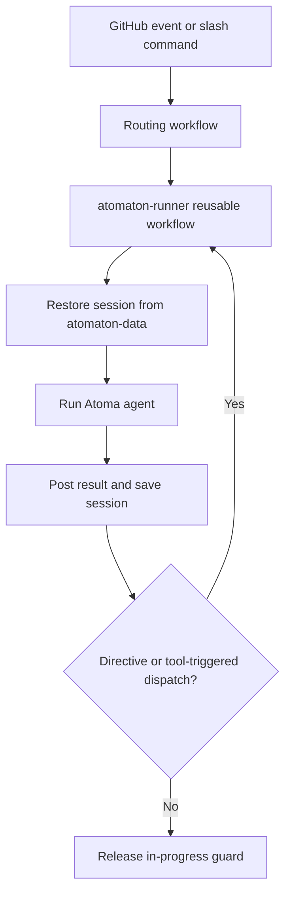

# What starts a run

**Somebody asks.** That is the whole rule, and it is the only one.

| who asks | how |
| --- | --- |
| a person | comment `/engineer` (or any agent name) on an issue or pull request |
| an agent | names the next agent as its handoff, or `reviewer=` when it opens a pull request |

Nothing starts from a GitHub event on its own. Opening a pull request starts nobody;
pushing to one starts nobody; leaving a review starts nobody.

The person has to be a repository member, which is the boundary the whole untrusted
surface rests on — [who may start one](../boundaries.md#who-may-start-one).

## How to ask

An agent command must occupy its own line. Put instructions on following lines:

```text
/engineer
Implement the remaining acceptance criteria.
```

Text after an agent name on the command line is rejected rather than guessed at,
because the name is used as a filename and as a shell word. A comment says so on
the issue; a new issue's body reports it as a warning on the workflow run and
starts nothing.

The only supported modifier is `recover`, and only in a comment — a new issue's
first line takes a bare name and nothing else. What it archives and what it
rebuilds is
[start an agent again from a clean session](../tasks/start-an-agent-again-from-a-clean-session.md).

An agent asks in the same words. A handoff is a standalone `/agent-name` line in
the agent's own output with the request on the lines after it, and the first such
line is the one adopted. The name must have a definition in `agent-definitions/`,
or it is ignored and nothing is dispatched. How many handoffs may happen before a
person is asked instead is
[what bounds a chain of runs](../boundaries.md#what-bounds-a-chain-of-runs).

## The workflows behind it

These listen for a person's action:

- `atomaton-entry.yml` for `issues.opened`
- `atomaton-manual-comment.yml` for `issue_comment.created`
- `atomaton-pr-merged.yml` for merged pull request aggregation
- `atomaton-sub-issue-closed.yml` for the manual sub-issue close fallback

This one is dispatched rather than triggered:

- `atomaton-validate-pr.yml` runs the configured CI against an agent's pull
  request and publishes the result as a check run. `create_pr` starts it, and
  what happens to the result is
  [what an agent's pull request meets](../../pull-requests/how-it-works.md)

And `atomaton-runner.yml` is the shared executor: a reusable workflow the routing
workflows call, rather than four copies of the same job.

Why so much of this is dispatched rather than listened for is
[GitHub raises no event for its own token](github-raises-no-event-for-its-own-token.md).

## The shape of one run



What is restored and saved at either end is
[what a run leaves behind](../../records/how-it-works.md); the guard the last step
releases is [what keeps two runs off one issue](what-keeps-two-runs-off-one-issue.md).
